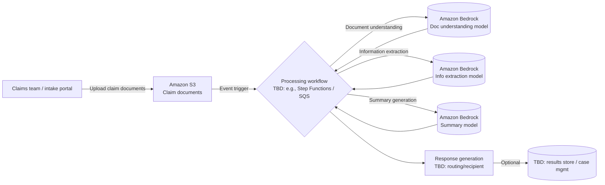

# aws-gen-ai-certification

## Architecture

- Storage for incoming claim documents: Amazon S3.
- Processing workflow: still to be defined (placeholder orchestrator in the diagram).
- Foundation model calls: Amazon Bedrock models selected for document understanding, information extraction, and summary generation.
- Response generation: represented as a TBD step while recipient/delivery channel is decided.

## Terraform

- Terraform configuration lives under `terraform/`.
- Update the `backend "s3"` bucket/key/region in `terraform/backend.tf` to point at an existing state bucket before running Terraform (backend buckets must exist prior to `terraform init`). Default region: `eu-central-1`.
- Tested with Terraform >= 1.9 and AWS provider >= 5.0 (provider/module versions are unpinned to pull latest compatible releases).
- Before running Terraform, set up an IAM user with permissions for S3 and state backend access, and export credentials in your shell (e.g., `AWS_ACCESS_KEY_ID`, `AWS_SECRET_ACCESS_KEY`, `AWS_DEFAULT_REGION=eu-central-1`).
- Bucket name can be overridden via env var: `export TF_VAR_claim_documents_bucket_name=your-bucket-name`
- Build the Lambda before planning/applying Terraform (requires Gradle locally): `cd lambda && gradle shadowJar` (jar emitted to `lambda/build/libs/claim-document-processor.jar`).
- Commands (run from `terraform/` after building the jar):
  - `terraform init`
  - `terraform plan`
  - `terraform apply`

## Lambda: Claim Processor

What it does
- Trigger: S3 `ObjectCreated` on the claims bucket.
- Action: Reads the uploaded document, builds a prompt that extracts policy context from the document itself, invokes Amazon Bedrock, and writes the model output to the same bucket as `<key>_result`.
- Runtime/handler: Java 17, `com.example.claims.ClaimProcessorHandler::handleRequest`.
- Model ID is hardcoded to `anthropic.claude-sonnet-4-5-20250929-v1:0` in code.

Build and test locally
- `cd lambda`
- Build shaded jar: `./gradlew shadowJar` (outputs `build/libs/claim-document-processor.jar`)

Deploy with Terraform (after building the jar)
- `cd terraform`
- `terraform init`
- `terraform apply`
- Terraform wires the S3 notification to the Lambda and grants invoke permission from that bucket.
- Terraform wires the Lambda; model ID is set in code (change in `ClaimProcessorHandler` if needed).
- Terraform expects the jar at `../lambda/build/libs/${lambda_function_name}.jar` (default function name: `claim-document-processor`)

Policy/permissions summary
- Lambda IAM role: CloudWatch Logs, S3 get/put/list on the claims bucket, Bedrock invoke.
- S3 bucket notification (all object creates) invokes the Lambda; adjust filters in `lambda.tf` if you want prefix/suffix restrictions.
